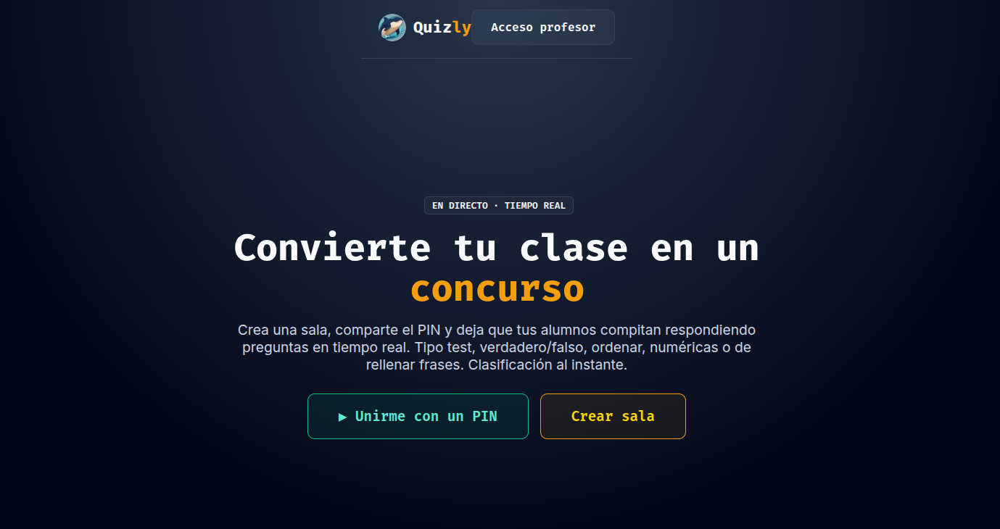

<div align="center">

# 🎯 Quizly

**Convierte tu clase en un concurso.**
Plataforma educativa de gamificación en tiempo real — tipo Kahoot.




</div>

---

## ¿Qué es?

Quizly es una app educativa para **gamificar el aula**. El profesor crea una sala,
los alumnos se unen con un **PIN** desde el móvil y responden preguntas en directo,
con puntuación por velocidad, ranking en vivo, sonidos y confeti.

Ideal para repasar temario de forma divertida y competitiva.

## ✨ Funcionalidades

- 📝 **6 tipos de pregunta**: test, verdadero/falso, respuesta múltiple, ordenar, numérica (slider) y rellenar frase.
- ⚡ **Tiempo real** vía WebSockets — salas efímeras con PIN.
- 👥 **Modo por equipos**, power-up x2 y aleatorización de preguntas/opciones.
- 🖼️ **Imágenes por pregunta** y fotos de perfil (o avatares emoji).
- 🤖 **Generación de quizzes con IA** (Claude) — opcional.
- 📂 Carpetas, import/export JSON y duplicado de quizzes.
- 📊 **Historial de partidas**, informe detallado y export CSV.
- 👨‍🏫 **Multi-profesor**, roles, cambio de contraseña y rate-limiting.
- 📱 **PWA** + modo proyector.

## 🛠️ Stack

FastAPI · WebSockets · Jinja2 · MariaDB/MySQL (PyMySQL) · Uvicorn · Vanilla JS

---

## 🚀 Puesta en marcha en local (Docker)

Requiere **Docker** y **Docker Compose**.

```bash
# 1. Clonar
git clone https://github.com/Maalfer/quizly.git
cd quizly

# 2. Configurar el entorno
cp .env.example .env
#    Genera un secreto y pégalo en QUIZLY_SECRET del .env:
python -c "import secrets; print(secrets.token_hex(32))"
#    (ajusta también MYSQL_PASSWORD y MYSQL_ROOT_PASSWORD)

# 3. Levantar SOLO la base de datos (MariaDB)
docker compose up -d db

# 4. Levantar la aplicación (crea tablas y admin por defecto al arrancar)
docker compose up -d --build web

# 5. (Opcional) Poblar profesores de ejemplo
docker compose run --rm web python populate_users.py
```

La app queda disponible en **http://localhost:9091**

### Credenciales por defecto

| Usuario | Contraseña | Acceso          |
| ------- | ---------- | --------------- |
| `admin` | `admin`    | Acceso profesor |

> ⚠️ Cámbialas antes de exponer Quizly. El populate de ejemplo crea además
> `profe`, `laura`, `carlos` e `invitado` (ver `populate_users.py`).

### Comandos útiles

```bash
docker compose up -d db                 # arrancar solo la base de datos
docker compose logs -f web              # ver logs de la app
docker compose run --rm web python populate_users.py   # poblar usuarios
docker compose down                     # parar todo (conserva los datos)
docker compose down -v                  # parar y BORRAR los datos de la BD
```

---

## 💻 Ejecución sin Docker (opcional)

Necesitas Python 3.12 y un MariaDB/MySQL accesible.

```bash
python -m venv venv && source venv/bin/activate
pip install -r requirements.txt
cp .env.example .env        # pon MYSQL_HOST=127.0.0.1 y tus credenciales
python populate_users.py    # opcional
uvicorn app:app --host 0.0.0.0 --port 9091
```

---

## ⚙️ Configuración (`.env`)

| Variable             | Descripción                                              |
| -------------------- | -------------------------------------------------------- |
| `QUIZLY_SECRET`      | Clave para firmar las sesiones (genera una aleatoria).   |
| `MYSQL_HOST`         | `db` con Docker, `127.0.0.1` en local.                   |
| `MYSQL_PORT`         | Puerto de MariaDB (por defecto `3306`).                  |
| `MYSQL_USER`         | Usuario de la base de datos.                             |
| `MYSQL_PASSWORD`     | Contraseña del usuario.                                  |
| `MYSQL_DB`           | Nombre de la base de datos.                              |
| `MYSQL_ROOT_PASSWORD`| Contraseña de root (solo la usa el contenedor de la BD). |
| `ANTHROPIC_API_KEY`  | *(Opcional)* activa la generación de quizzes con IA.     |
| `QUIZLY_AI_MODEL`    | Modelo de IA a usar (por defecto `claude-sonnet-4-6`).   |

> Ningún secreto se versiona: `.env` está en `.gitignore`. Parte siempre de `.env.example`.

---

## 📄 Licencia

[MIT](LICENSE) © 2026 Maalfer

---

<div align="center">

### ⭐ Historial de estrellas

[](https://star-history.com/#Maalfer/quizly&Date)

</div>
